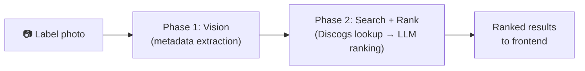
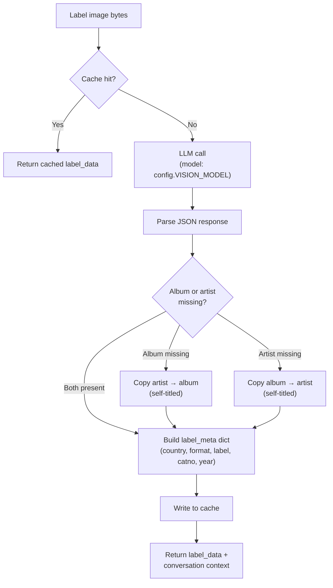
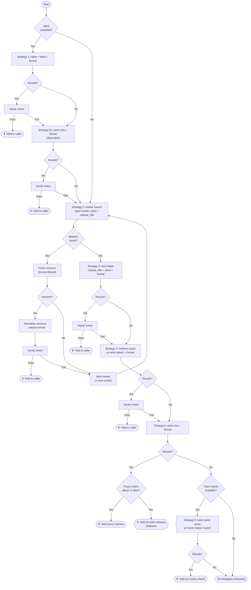
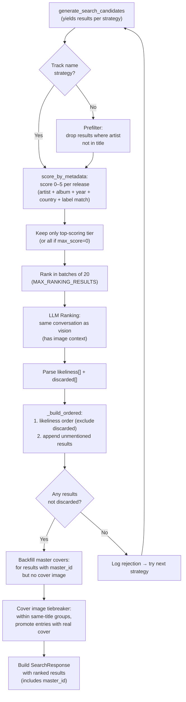
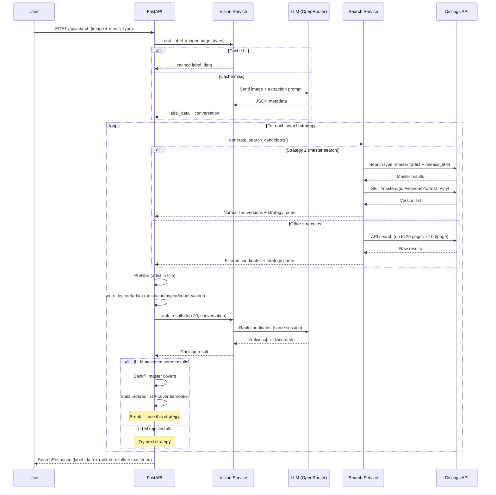

# Search Strategy

## Overview

The search pipeline identifies a physical record (vinyl/CD) from a label photo. It runs in two phases: **Vision** (LLM extracts metadata from the image) and **Search + Rank** (Discogs API queries → filtering → LLM ranking).

---

## Phase 1: Vision — Label Reading

The LLM receives the label image and extracts structured metadata.

**Input:** Raw image bytes + media type (vinyl or CD)

**Output:** JSON with these fields:
- `albums[]` — possible album names (most likely first)
- `artists[]` — possible artist names
- `tracks[]` — visible track/song names
- `country` — only if explicitly printed on the label
- `format` — LP, EP, 45 RPM, CD, etc.
- `label` — record label name (Columbia, RCA, etc.)
- `catno` — catalog number
- `year` — year of this pressing (prefers © over ℗)

**Self-titled handling:** If only artist or only album is extracted, the missing field is filled with the other (assumes self-titled release).

**Caching:** Responses are cached by image content hash to avoid redundant LLM calls for the same image.

---

## Phase 2: Search + Rank

### 2a. Strategy Generator (`generate_search_candidates`)

Strategies are tried in priority order. Each yields results to the caller, which decides whether to accept them (based on LLM ranking). If the LLM rejects all candidates from a strategy, the next strategy is tried.

**Pagination defaults:** 100 results per page, up to 20 pages (max 2,000 results per strategy). Master versions use 100/page, up to 10 pages.

#### Strategy details

| # | Strategy | Discogs params | Sanity check | Notes |
|---|----------|---------------|:---:|-------|
| 1 | Catalog number + label | `catno`, `label`, `format` | Yes | Most precise — exact pressing match |
| 1b | Catalog number only | `catno`, `format` | Yes | Fallback when label name doesn't match Discogs spelling |
| 2 | Master search → versions | `type=master`, `artist`, `release_title` → `/masters/{id}/versions` | Yes | Finds canonical album, gets all pressings with format filter |
| 3 | Strict fields | `release_title`, `artist`, `format` | Yes | Exact field matching on releases |
| 4 | Freeform query | `q="artist album"`, `format` | Yes | Broad search, good for common releases |
| 5 | Artist only | `artist`, `format` | No (fuzzy) | Fetches all releases by artist, fuzzy-matches album title locally |
| 6 | Track names | `q="track1 track2 track3"` | No | Last resort — uses up to 3 track names as query |

#### Master search flow (Strategy 2)

1. Search Discogs for masters matching `artist` + `release_title`
2. For each unique master found:
   - Extract `master_id` and `cover_image` from master search result
   - Fetch all versions via `/masters/{id}/versions` (filtered by format, e.g. `Vinyl`)
   - Normalize each version to release search result format (prepend artist to title, extract year, wrap label in list, attach master cover + master_id)
   - Apply sanity check → yield passing results
3. Deduplicates masters across album/artist variation combos (each master_id fetched only once)
4. **Self-titled track overlap:** When the release is self-titled and track names were extracted, and multiple masters pass sanity check, the code fetches full master detail for each, computes track overlap via `_track_overlap()`, and re-sorts masters by overlap score (best match first)
5. **Master fallback:** After all masters are processed, if any passed sanity check, they are yielded as a `"master fallback"` strategy and the generator returns early — strategies 3–6 are skipped entirely. The processing pipeline bypasses prefilter, scoring, and LLM ranking for this strategy

#### Catno normalization

Before searching, catalog numbers go through `_normalize_catno()`:
1. Original value (always tried first)
2. Strip trailing side indicator via regex `[\s-][AB]$` (case-insensitive)
3. If the stripped form differs and contains dots, add a variant with dots removed
4. If no side indicator was found, add a dot-removed variant of the original (e.g., `S.M.1234` → `SM1234`)

#### Sanity check (`_sanity_check`)

Uses `SequenceMatcher` to compare each result's artist and album against the LLM-extracted values. A result passes if **any** of these hold:
- Artist similarity ≥ 0.5
- Album similarity ≥ 0.5
- Artist substring containment (`_contains_any`) — candidate appears in result or vice versa
- Album substring containment (`_contains_any`)

This filters out irrelevant results that Discogs returns due to loose text matching.

- Strategies 1–4 use sanity checking
- Strategy 5 uses its own fuzzy title matching instead
- Strategy 6 skips sanity checks entirely (relies on LLM ranking)

---

### 2b. Processing Pipeline (`process_single_image`)

For each strategy that yields results, the pipeline applies filtering and ranking before deciding whether to accept or try the next strategy.

---

### 2c. Prefilter (`prefilter`)

Quick pass that drops results where none of the candidate artist names appear in the Discogs title string. If filtering would remove everything, the originals are kept (safety net). Skipped for track-name strategies since there's no artist to filter on.

---

### 2d. Metadata Scoring (`score_by_metadata`)

Each result gets 0–5 points based on deterministic field matching:

| Field | +1 point if |
|-------|-------------|
| Artist | Artist similarity ≥ 0.5 |
| Album | Album similarity ≥ 0.5 |
| Year | Release year matches LLM-extracted year |
| Country | Release country matches LLM-extracted country |
| Label | Any release label matches LLM-extracted label |

Only the highest-scoring tier is kept. If no release scores above 0, all are kept unchanged. This narrows results to the most likely pressing before the LLM sees them.

---

### 2e. LLM Ranking (`rank_results`)

Results (after filtering and scoring) are sent to the **same LLM conversation** that analyzed the label image in **batches of 20** (`MAX_RANKING_RESULTS`). If the LLM rejects an entire batch, the next batch is tried before falling through to the next strategy.

**Input to LLM:** Array of candidate objects with `index`, `title`, `year`, `country`, `format`, `label`, `catno`.

**Output from LLM:** JSON with:
- `likeliness[]` — indexes ordered from most to least likely
- `discarded[]` — indexes the LLM is certain are wrong

**Result assembly** (`_build_ordered`):
1. Add releases in `likeliness` order (excluding any in `discarded`)
2. Append any remaining releases not mentioned in either list
3. If the final list is empty (all discarded, none in likeliness), try the next batch — if all batches rejected, the strategy is rejected and the next one is tried

**`is_master_fallback` flag:** When the winning strategy is `"master fallback"`, each `DiscogsResult` gets `is_master_fallback=True`. The frontend uses this to show a badge and disable the "Add to collection" button (since it's a master, not a specific pressing).

---

### 2f. Master Cover Backfill

After a winning strategy is found, results that have a `master_id` get their `cover_image` replaced with the master release cover. This always overwrites — master covers are preferred because release covers are often low-quality label photos, while the master has canonical artwork. Master covers are cached per `master_id` to avoid redundant API calls.

---

### 2g. Cover Image Tiebreaker

Final pass over the ordered results. Within groups of consecutive results that share the same title, entries with a real cover image (not a Discogs spacer placeholder) are promoted. Uses stable sorting to preserve the LLM's ordering within each subgroup.

---

## End-to-End Flow

