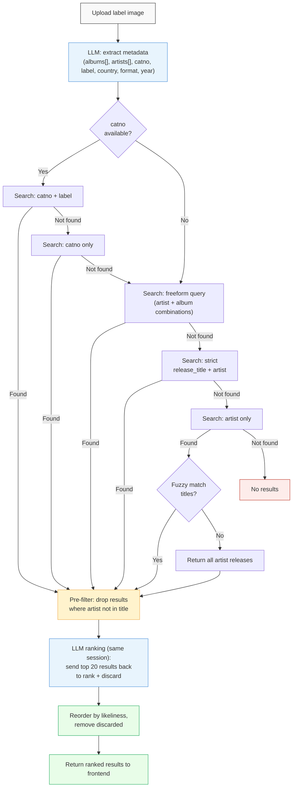

# Search Strategy

```mermaid
flowchart TD
    A["Upload label image"] --> B["LLM: extract metadata\n(albums[], artists[], catno, label, country, format, year)"]

    B --> C{"catno\navailable?"}

    C -- Yes --> D["Search: catno + label"]
    D -- Found --> PF
    D -- Not found --> E["Search: catno only"]
    E -- Found --> PF
    E -- Not found --> F

    C -- No --> F["Search: freeform query\n(artist + album combinations)"]
    F -- Found --> PF
    F -- Not found --> G["Search: strict\nrelease_title + artist"]
    G -- Found --> PF
    G -- Not found --> H["Search: artist only"]

    H -- Found --> I{"Fuzzy match\ntitles?"}
    I -- Yes --> PF
    I -- No --> J["Return all artist releases"]
    J --> PF

    H -- Not found --> K["No results"]

    PF["Pre-filter: drop results\nwhere artist not in title"] --> LLM

    LLM["LLM ranking (same session):\nsend top 20 results back\nto rank + discard"] --> R["Reorder by likeliness,\nremove discarded"]

    R --> L["Return ranked results to frontend"]

    style A fill:#f9f9f9,stroke:#333
    style B fill:#e8f4fd,stroke:#4a90d9
    style PF fill:#fff3cd,stroke:#f0ad4e
    style LLM fill:#e8f4fd,stroke:#4a90d9
    style R fill:#e8fde8,stroke:#27ae60
    style K fill:#fdecea,stroke:#c0392b
    style L fill:#e8fde8,stroke:#27ae60
```
